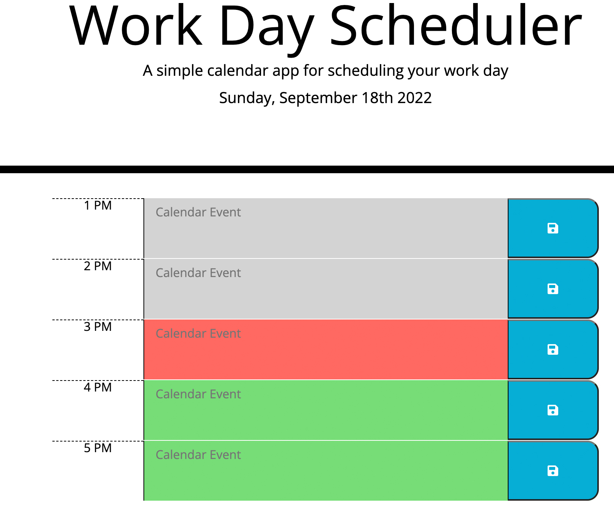
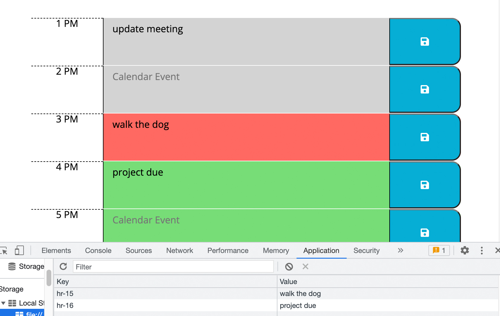

# Work Day Scheduler
daily planner broken in to hours that store events

UCLA Bootcamp Challenge 5 - Module 5 - Third Party APIs

Due Date 9/12/2022

## Challenge Task
---

Create a simple calendar application that allows a user to save events for each hour of the day.

The following animation demonstrates the application functionality:

## Requirements
---

- When daily planner is opened the current date and time is shown at the top
- As I scroll down hourly time blocks are presented for a standard business hours
- each timeblock is color coded to indicate whether it is in the past, present, or future (like the picture below):

- clicking into a timeblock allows you enter a new event
- the save button style is specified by the fontawesome
- clicking the save button stores the value of the event into localstorage
- upton refresh calendar retrieves any saved events previously stored in localstorage. (like the picture below)

## Final Submission
---
1. Work day scheduler application is deployed and can be seen at: [Daily Planner](https://me-ross.github.io/work-day-scheduler/)

2. Repository for Work day scheduler application can be found at: [GitHub](https://github.com/Me-ross/work-day-scheduler/)

